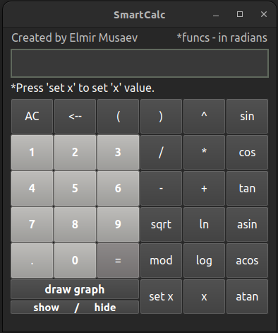
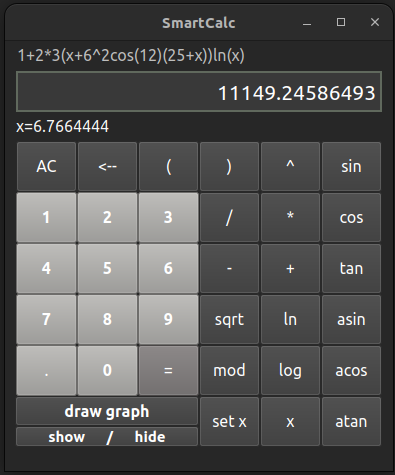
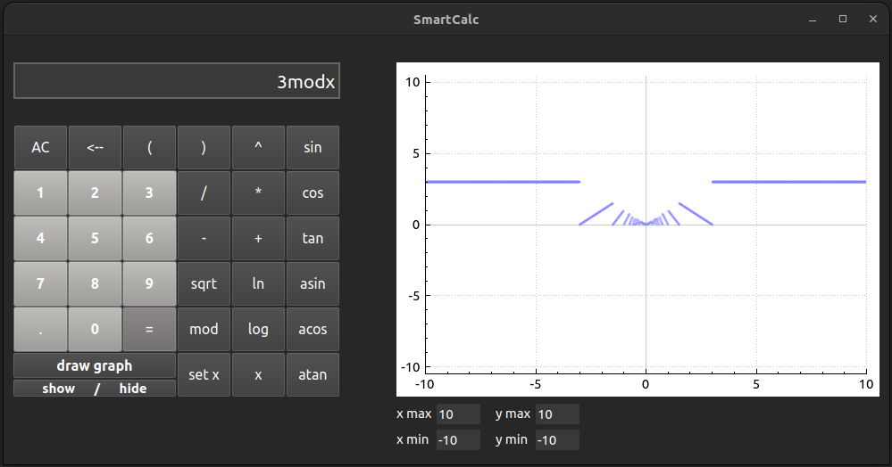
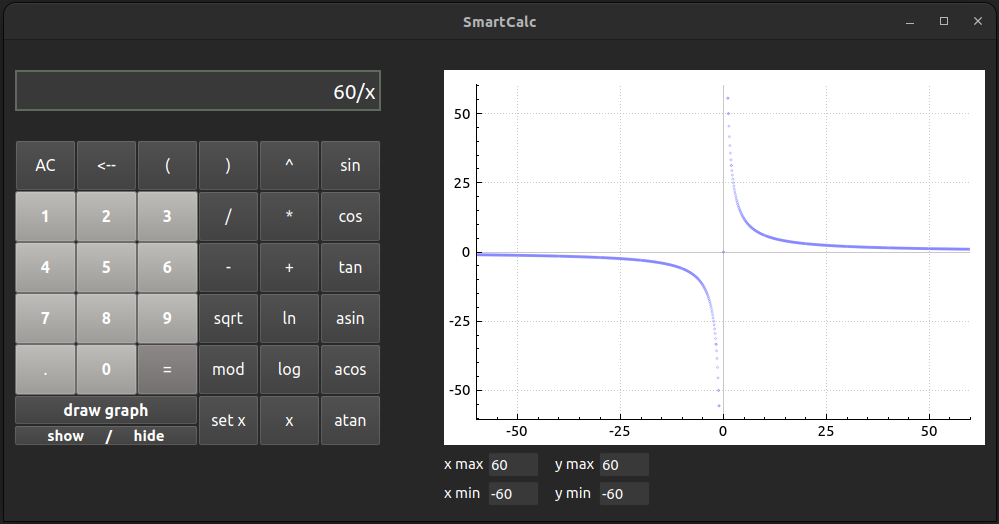
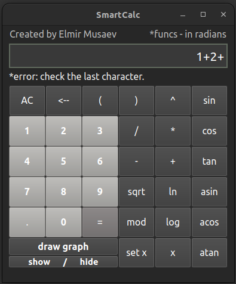
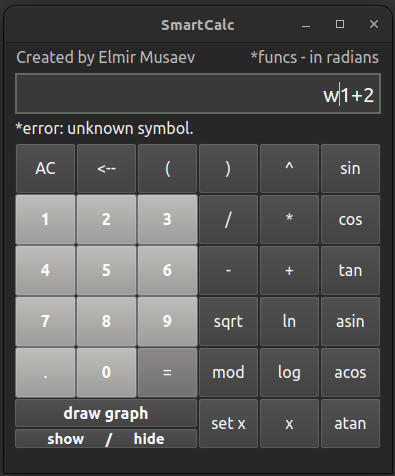
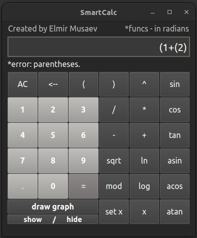
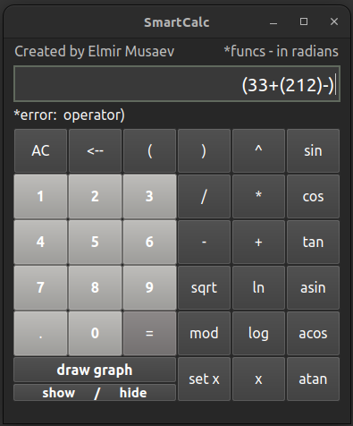

# Smart Calculator
In this Project I wrote a Calculator with GUI (completely by myself).  
The Calculator supports trigonometric funtions and all basic math operations (also: sqrt, ln, log, mod).  
The Calculator was covered by a huge amount of tests (see ./exe/unit_tests.c), what excludes ~99.5% of possible errors.  
Works on: MACOS, Linux, Windows.  

See Task.md  

## Screenshots

&emsp;&emsp;&emsp;&emsp;&emsp;&emsp;&emsp;&emsp;&emsp;&emsp;  
  
  
&emsp;&emsp;&emsp;&emsp;&emsp;&emsp;&emsp;&emsp;&emsp;&emsp;&emsp;&emsp;&emsp;&emsp;&emsp;&emsp;&emsp;&emsp;&emsp;&emsp;&emsp;&emsp;&emsp;&emsp;&emsp;&emsp;&emsp;&emsp;&emsp;&emsp;  
